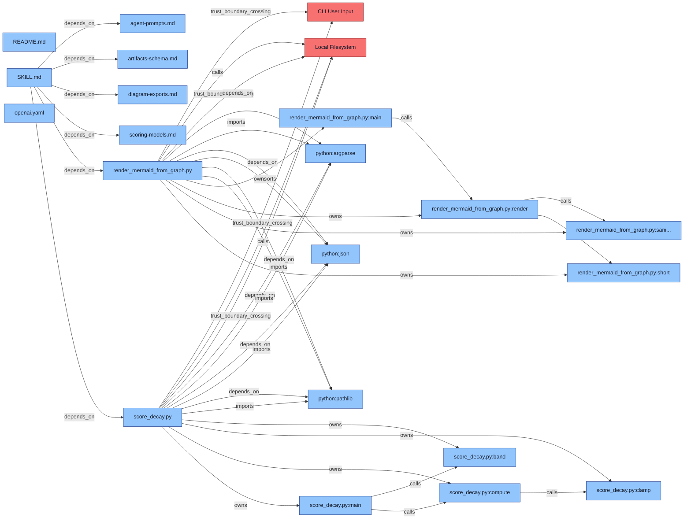

# Code Autopsy Report

This page is a GitHub-friendly dashboard for viewing autopsy outputs in one place.

Regenerate with:

```bash
python3 code-autopsy/scripts/generate_report.py --root . --out docs/REPORT.md
```

## Quick Links

- [Skill Definition](../code-autopsy/SKILL.md)
- [Agent Prompts](../code-autopsy/references/agent-prompts.md)
- [Artifact Schema](../code-autopsy/references/artifacts-schema.md)
- [Scoring Models](../code-autopsy/references/scoring-models.md)

## Architecture Diagram



## Dashboard Snapshot

| Field | Value |
|---|---|
| Generated At | 2026-02-28T03:52:45Z |
| Repo | openai-lorongai-hackathon |
| Decay Window (Months) | 24 |
| Graph Confidence | 0.87 |
| Metrics Confidence | 0.78 |
| Attack Surface Confidence | 0.66 |
| Forecast Confidence | 0.74 |

## Top Hotspots

| Rank | Module | Hotspot Score |
|---|---|---|
| 1 | code-autopsy/scripts/render_mermaid_from_graph.py | 0.5209 |
| 2 | code-autopsy/scripts/score_decay.py | 0.4863 |
| 3 | code-autopsy/SKILL.md | 0.3826 |
| 4 | code-autopsy/references/artifacts-schema.md | 0.1687 |
| 5 | code-autopsy/references/diagram-exports.md | 0.1477 |

## Top Attack Paths

1. **Risk:** 0.58  
   **Path:** module:code-autopsy/SKILL.md -> module:code-autopsy/scripts/render_mermaid_from_graph.py -> external:filesystem  
   **Notes:** Untrusted graph.json can expand diagram size and drive oversized output writes.

1. **Risk:** 0.54  
   **Path:** module:code-autopsy/SKILL.md -> module:code-autopsy/scripts/score_decay.py -> external:filesystem  
   **Notes:** CLI-controlled metrics path crosses trust boundary to local file read/write.

1. **Risk:** 0.36  
   **Path:** module:code-autopsy/agents/openai.yaml -> module:code-autopsy/SKILL.md -> module:code-autopsy/references/artifacts-schema.md  
   **Notes:** Prompt/reference tampering can steer generated artifacts and reduce assurance.

## Failure Scenarios

| Scenario | First Break Modules | Blast Radius | Confidence |
|---|---|---|---|
| traffic_x10 | code-autopsy/scripts/render_mermaid_from_graph.py | module:code-autopsy/scripts/render_mermaid_from_graph.py, external:filesystem | 0.71 |
| dep_update | code-autopsy/scripts/score_decay.py | module:code-autopsy/scripts/score_decay.py, module:code-autopsy/references/scoring-models.md | 0.62 |
| hotspot_change | code-autopsy/SKILL.md, code-autopsy/scripts/render_mermaid_from_graph.py | module:code-autopsy/SKILL.md, module:code-autopsy/scripts/render_mermaid_from_graph.py, module:code-autopsy/references/artifacts-schema.md | 0.68 |

## Decay Forecast

| Module | Decay Score | Maintainability Risk | Drivers |
|---|---|---|---|
| code-autopsy/scripts/render_mermaid_from_graph.py | 0.4957 | medium | complexity, coupling, ownership_risk, test_desert |
| code-autopsy/scripts/score_decay.py | 0.4661 | medium | complexity, coupling, ownership_risk, test_desert |
| code-autopsy/SKILL.md | 0.4338 | medium | complexity, coupling, ownership_risk, test_desert |
| code-autopsy/references/artifacts-schema.md | 0.3165 | medium | complexity, coupling, ownership_risk, test_desert |
| code-autopsy/references/diagram-exports.md | 0.2985 | low | complexity, coupling, ownership_risk, test_desert |
| code-autopsy/references/scoring-models.md | 0.2969 | low | complexity, coupling, ownership_risk, test_desert |
| code-autopsy/references/agent-prompts.md | 0.2857 | low | complexity, coupling, ownership_risk, test_desert |
| code-autopsy/agents/openai.yaml | 0.272 | low | complexity, coupling, ownership_risk, test_desert |
| README.md | 0.266 | low | complexity, coupling, ownership_risk, test_desert |

## Raw Artifact Links

- [dashboard_state.json](../dashboard_state.json)
- [attack_surface.json](../attack_surface.json)
- [failure_simulation.json](../failure_simulation.json)
- [decay_forecast.json](../decay_forecast.json)
- [metrics.json](../metrics.json)
- [graph.json](../graph.json)
- [repo.json](../repo.json)
